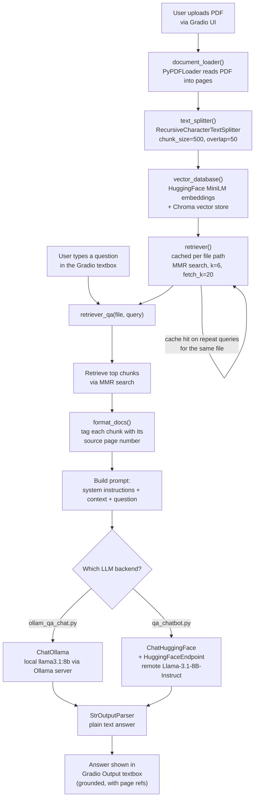

# PDF Q&A Chatbot (RAG with LangChain + Gradio)

A Retrieval-Augmented Generation (RAG) chatbot that lets you upload a PDF and ask
questions about it. The answer is generated **only** from the content retrieved
from the document, with page numbers cited where possible.

The repo ships **two interchangeable implementations** of the same app:

| File | LLM Backend | Runs Where | Needs API Key? |
|---|---|---|---|
| `ollam_qa_chat.py` | [Ollama](https://ollama.com) (`llama3.1:8b` by default) | 100% local | No |
| `qa_chatbot.py` | Hugging Face Inference Endpoint (`meta-llama/Llama-3.1-8B-Instruct`) | Local app, remote inference | Yes (`HF_API_TOKEN`) |

Both scripts share the same embedding model (`sentence-transformers/all-MiniLM-L6-v2`,
runs locally via `HuggingFaceEmbeddings`), the same Chroma vector store, and the
same Gradio UI — only the answer-generation LLM differs.

---

## 1. How It Works (Architecture)



**Key design points baked into the code:**
- **Caching (`_RETRIEVER_CACHE`)** — each uploaded file is embedded only once; asking
  multiple questions about the same PDF reuses the same vector store instead of
  re-processing it every time.
- **MMR retrieval** (`search_type="mmr"`) — pulls diverse, non-redundant chunks
  instead of near-duplicate top-k matches, using a wider `fetch_k=20` pool narrowed
  to `k=6`.
- **Strict grounding** — the system prompt instructs the model to answer only from
  the retrieved context and to explicitly say `"I don't know based on the provided
  document."` if the answer isn't there, reducing hallucination.
- **Page citations** — `format_docs()` tags every chunk with `[Page N]` so the LLM
  can reference where its answer came from.

---

## 2. Prerequisites

- Python 3.10+
- pip
- For `ollam_qa_chat.py`: [Ollama](https://ollama.com) installed and running locally
- For `qa_chatbot.py`: a free [Hugging Face](https://huggingface.co) account and
  API token

---

## 3. Installation

```bash
# Clone the repo
git clone https://github.com/mishbhav/coursera_projects.git
cd coursera_projects

# (Recommended) create a virtual environment
python -m venv venv
source venv/bin/activate      # on Windows: venv\Scripts\activate

# Install dependencies
pip install -r requirements.txt
```

If `requirements.txt` doesn't already include everything, make sure these are
installed:

```bash
pip install gradio langchain langchain-core langchain-community langchain-text-splitters \
            langchain-huggingface langchain-ollama chromadb pypdf sentence-transformers
```

---

## 4. Running Option A — Local, via Ollama (`ollam_qa_chat.py`)

Fully local, no API key, no rate limits, no data leaving your machine.

1. **Install Ollama**: download from https://ollama.com and install it.
2. **Pull the model** (one-time download):
   ```bash
   ollama pull llama3.1:8b
   ```
   If your machine is CPU-only or 8B is too slow, use a lighter model instead:
   ```bash
   ollama pull qwen2.5:3b
   # or
   ollama pull phi3:mini
   ```
   Then tell the script which model to use via an environment variable:
   ```bash
   export OLLAMA_MODEL=qwen2.5:3b     # on Windows (PowerShell): $env:OLLAMA_MODEL="qwen2.5:3b"
   ```
3. **Start the Ollama server** (usually starts automatically after install; if not):
   ```bash
   ollama serve
   ```
4. **Run the app**:
   ```bash
   python ollam_qa_chat.py
   ```
5. Open the printed local URL (default **http://127.0.0.1:7860**) in your browser.

---

## 5. Running Option B — Hugging Face Inference Endpoint (`qa_chatbot.py`)

Uses a remote model, so you need a Hugging Face API token.

1. **Get a token**: create one at https://huggingface.co/settings/tokens
   (a "Read" token is enough).
2. **Set the environment variable** before running:
   ```bash
   export HF_API_TOKEN=hf_xxxxxxxxxxxxxxxxxxxxxxxxxxxx   # on Windows (PowerShell): $env:HF_API_TOKEN="hf_xxx..."
   ```
   > If you're using a GitHub Codespace / devcontainer, add `HF_API_TOKEN` as a
   > repository secret and **restart the Codespace container** afterward so it
   > gets picked up — the script will raise a clear error if the token isn't set.
3. **Run the app**:
   ```bash
   python qa_chatbot.py
   ```
4. Open the printed local URL (default **http://127.0.0.1:7860**) in your browser.

---

## 6. Using the App

1. Upload a PDF using the **Upload PDF File** box.
2. Type a question in the **Input Query** box.
3. Click **Submit**. The first query on a new file will take longer (it has to
   load, chunk, and embed the whole PDF); subsequent questions on the same file
   are fast thanks to the retriever cache.
4. The **Output** box shows the answer, grounded in the document, with page
   references when available. If the document doesn't contain the answer, the
   bot will say so instead of guessing.

---

## 7. Configuration Reference

| Variable / Setting | Where | Default | Purpose |
|---|---|---|---|
| `OLLAMA_MODEL` | env var (`ollam_qa_chat.py`) | `llama3.1:8b` | Which local Ollama model to use |
| `HF_API_TOKEN` | env var (`qa_chatbot.py`) | — (required) | Hugging Face API token for remote inference |
| `chunk_size` / `chunk_overlap` | `text_splitter()` | 500 / 50 | Controls how the PDF is split before embedding |
| `search_kwargs` (`k`, `fetch_k`) | `retriever()` | 6 / 20 | Number of chunks retrieved per query (MMR) |
| `temperature` | `get_llm()` | 0.1 | Lower = more factual/deterministic answers |
| `server_port` | `.launch()` | 7860 | Port the Gradio app runs on |

---

## 8. Project Structure

```
coursera_projects/
├── .devcontainer/       # Codespace/devcontainer config
├── ollam_qa_chat.py     # RAG chatbot using local Ollama LLM
├── qa_chatbot.py        # RAG chatbot using Hugging Face Inference Endpoint
├── requirements.txt     # Python dependencies
├── README.md            # This file
└── .gitignore
```

---

## 9. Troubleshooting

- **`HF_API_TOKEN is missing!` error** — set the `HF_API_TOKEN` environment
  variable and restart your terminal/Codespace, then re-run `qa_chatbot.py`.
- **Ollama connection errors** — make sure `ollama serve` is running and that you
  ran `ollama pull <model>` for the model named in `OLLAMA_MODEL` first.
- **Slow first response** — expected; the PDF is being loaded, chunked, and
  embedded. Subsequent questions on the same file are cached and much faster.
- **Answers seem generic or wrong** — try increasing `k`/`fetch_k` in
  `retriever()`, or lowering `chunk_size` for more granular retrieval.
